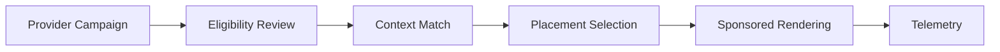

# Ads Monetization Engine

## Purpose

The Ads Monetization Engine defines lightweight sponsored visibility for LUVO discovery surfaces while protecting editorial quality, recommendation integrity, and tourism trust.

## Supported Surfaces

- sponsored places
- promoted discovery cards
- nearby sponsored suggestions
- tourism placements
- provider promotion slots
- category sponsorships
- vibe-aligned sponsorships

## Monetization Flow

## Ranking Influence Boundaries

Sponsored visibility may influence placement only inside clearly marked sponsored surfaces. It must not override organic editorial ranking, hidden gem preservation, safety rules, or semantic relevance.

## Required Disclosure

Sponsored content must be visually labeled and must remain distinguishable from organic recommendations.

## Anti-Spam Rules

The system must prevent repeated promoted cards, low-context placements, irrelevant ads, excessive sponsor density, and pay-to-win discovery behavior.

## MVP Scope

MVP supports fixed sponsored slots, provider promotion metadata, basic performance telemetry, and manual campaign approval.