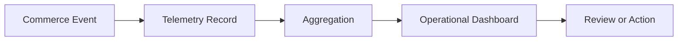

# Commerce Observability Framework

## Purpose

The Commerce Observability Framework defines how LUVO monitors marketplace activity across providers, orders, reservations, sponsored placements, tourism commerce, and operational workflows.

This framework remains lightweight and Base44-realistic. It does not require a warehouse, distributed tracing stack, or advanced analytics platform for MVP.

## Observability Domains

- provider activity
- order lifecycle activity
- reservation lifecycle activity
- sponsored placement visibility
- tourism commerce engagement
- operational remediation activity
- marketplace quality signals

## Commerce Telemetry Flow

## Core Metrics

| Metric | Purpose |
|---|---|
| provider_visibility | provider exposure health |
| commerce_intent_rate | discovery-to-commerce signal |
| order_completion_rate | order flow health |
| reservation_completion_rate | booking flow health |
| sponsored_visibility_rate | monetization exposure control |
| remediation_backlog | operational risk |
| provider_response_time | provider execution quality |
| marketplace_quality_score | overall trust signal |

## Alert Conditions

Operators should review:

- sudden drop in provider visibility
- unusual increase in failed order states
- unusual increase in reservation unresolved states
- sponsored content saturation
- high remediation backlog
- stale provider records

## MVP Dashboard Requirements

Dashboards must show:

- daily commerce activity
- provider operational health
- unresolved commerce records
- sponsored placement performance
- tourism commerce signals

## Operational Boundary

Commerce observability supports operational decisions. It does not replace financial reporting, accounting systems, or external analytics platforms in MVP.
