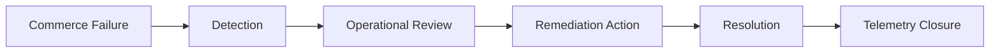

# Commerce Remediation Framework

## Purpose

Defines how LUVO handles failed operational commerce scenarios while preserving marketplace trust, tourism quality, and operational continuity.

## Remediation Scope

- failed orders
- failed reservations
- provider disputes
- stale provider states
- sponsored visibility conflicts
- unresolved operational escalations

## Remediation Lifecycle

## Remediation States

- detected
- triaged
- under_review
- awaiting_provider
- resolved
- escalated
- archived

## Operational Actions

Operators may:

- suspend provider visibility
- flag stale records
- close invalid reservations
- quarantine suspicious commerce activity
- remove abusive sponsored visibility

## Escalation Rules

Escalation is required when:

- provider abuse patterns repeat
- operational backlog grows beyond threshold
- marketplace trust is impacted
- tourism quality degradation is detected

## Replay Safety

Remediation actions must avoid:

- duplicate provider penalties
- duplicate reservation closures
- duplicate order remediation
- duplicate sponsored suppression

## MVP Boundary

The remediation framework is operationally managed and intentionally lightweight for MVP execution.
