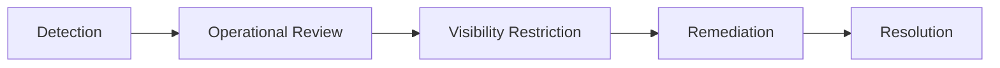

# Marketplace Safety Framework

## Safety Objectives

The marketplace safety framework protects discovery quality, tourism trust, provider integrity, and operational stability.

## Protected Areas

- local discovery
- tourism exploration
- recommendation integrity
- sponsored discovery quality
- provider trust
- semantic ranking quality

## Abuse Prevention

The system must detect and limit:

- duplicate listings
- misleading place information
- recommendation manipulation
- excessive sponsored repetition
- fake engagement patterns
- low-quality promotional spam

## Escalation Flow

## Moderation Actions

Operators may:

- limit visibility
- pause sponsored visibility
- request provider updates
- quarantine listings
- archive invalid records

## MVP Scope

Moderation remains operator-assisted. Autonomous moderation systems and advanced abuse ML are out of scope.