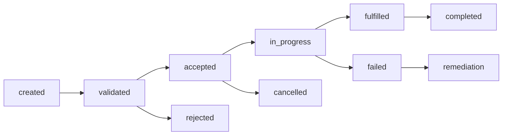

# Order Lifecycle Framework

## Purpose

Defines the lightweight operational lifecycle for LUVO marketplace orders. This document keeps order execution Base44-realistic and avoids heavy enterprise commerce assumptions.

## Order Lifecycle

## Order States

- created
- validation_required
- validated
- accepted
- rejected
- in_progress
- fulfilled
- completed
- cancelled
- failed
- remediation_required

## Validation Requirements

Orders must validate provider availability, item or service availability, customer contact fields, pricing snapshot, fulfillment method, and operational notes.

## Cancellation Rules

Cancellations require reason codes. Provider-side cancellations affect provider reliability score. Customer-side cancellations are tracked for operational review.

## Fallback Flows

If provider confirmation fails, preserve the order record, mark as remediation_required, emit telemetry, and show safe UX status.

## Operational Controls

Operators may mark orders as reviewed, escalate operational issues, apply remediation status, or archive failed orders after resolution.
