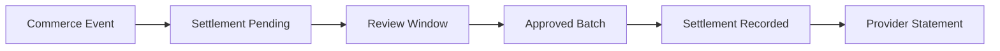

# Payout Settlement Framework

## Purpose

Defines the lightweight operational model for provider settlement tracking in LUVO Commerce Execution.

This framework does not implement banking rails, card issuing, lending, tax engines, or complex financial infrastructure.

## Settlement Lifecycle

## MVP Assumptions

- LUVO tracks settlement status operationally.
- External payment processors may handle actual movement of funds.
- Provider statements are informational records.
- Exceptions require operator review.

## Settlement States

- pending
- under_review
- approved
- recorded
- exception
- closed

## Reconciliation Inputs

- provider id
- commerce event id
- settlement window
- gross amount snapshot
- platform fee snapshot
- adjustment notes
- final status

## Failed Settlement Handling

If a settlement cannot be recorded, the record enters exception state and is reviewed by operations.

## Operational Boundary

Settlement documentation is operational tracking only. Payment processor implementation is out of scope for MVP.
