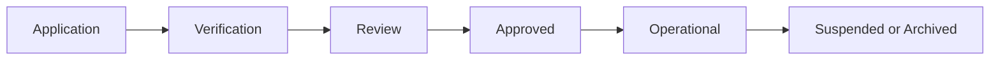

# Provider Management Framework

## Provider Lifecycle

## Provider States

- pending_review
- verification_required
- approved
- active
- temporarily_suspended
- permanently_suspended
- archived

## Trust Tiers

### Tier 1
Flagship verified providers.

### Tier 2
Operational trusted providers.

### Tier 3
New or low-history providers.

## Verification Inputs

- business identity
- operational contact
- category validation
- tourism relevance
- location validation
- moderation review

## Suspension Triggers

- fraudulent activity
- spam listings
- review manipulation
- repeated operational failures
- unsafe tourism experiences

## Moderation Constraints

Moderation must preserve local discovery integrity and prevent marketplace spam from degrading semantic exploration quality.
