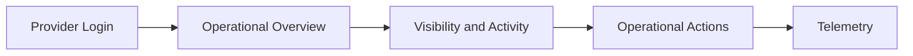

# Provider Operational Dashboard Framework

## Purpose

Defines the operational dashboard surfaces available to providers inside LUVO.

## Dashboard Modules

- visibility overview
- listing status
- reservation activity
- discovery performance
- sponsored placement visibility
- operational alerts
- profile completeness

## Operational Controls

Providers may:

- update availability
- manage listing metadata
- review visibility status
- manage sponsored visibility
- review operational notifications

## UX Requirements

Dashboards must remain:

- mobile friendly
- operationally simple
- tourism-aware
- lightweight
- fast-loading

## Dashboard Lifecycle

## MVP Scope

The MVP dashboard focuses on operational visibility and lightweight management controls. Advanced BI systems are out of scope.
