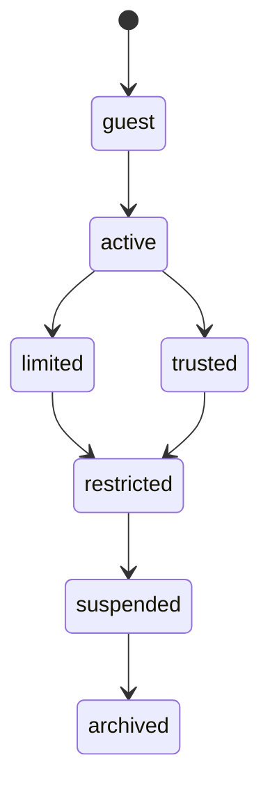

# Account State Machine

## Purpose

Defines canonical account states for users and providers participating in LUVO discovery, commerce, and tourism experiences.

## Canonical States

- guest
- active
- trusted
- limited
- restricted
- suspended
- archived

## State Lifecycle

## Operational Rules

- trusted accounts receive higher operational confidence
- restricted accounts may lose recommendation influence
- suspended accounts lose participation rights
- archived accounts remain historically auditable

## Moderation Integration

Moderation systems may trigger:

- visibility reduction
- review suppression
- recommendation suppression
- temporary restrictions
- suspension escalation

## MVP Boundary

The state machine remains operationally lightweight and moderation-aware without enterprise IAM complexity.
