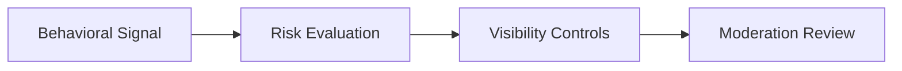

# Behavioral Risk Framework

## Purpose

Defines lightweight behavioral risk detection rules for marketplace integrity, recommendation trust, tourism safety, and moderation visibility.

## Behavioral Risk Indicators

- spam-like activity
- fake review bursts
- repeated moderation triggers
- rapid account switching
- abusive messaging patterns
- suspicious recommendation manipulation
- repeated reservation abuse

## Risk Levels

### Low Risk
Normal operational behavior.

### Medium Risk
Requires visibility monitoring.

### High Risk
Triggers moderation escalation.

## Behavioral Risk Lifecycle

## Safeguards

Behavioral risk systems must:

- preserve marketplace trust
- avoid recommendation corruption
- avoid tourism spam
- avoid fake engagement amplification

## MVP Boundary

The MVP uses moderation-aware heuristics and operational rules without advanced fraud ML systems.
