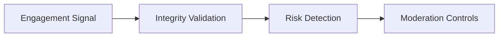

# Fake Engagement Prevention Framework

## Purpose

Defines operational safeguards against fake reviews, artificial recommendation boosting, tourism spam, and marketplace manipulation.

## Fake Engagement Risks

- coordinated reviews
- artificial saves or likes
- fake tourism recommendations
- recommendation amplification abuse
- provider self-promotion spam
- low-quality engagement loops

## Prevention Principles

- preserve recommendation reliability
- preserve tourism trust
- preserve provider fairness
- preserve discovery quality
- preserve marketplace safety

## Operational Safeguards

- moderation review thresholds
- trust-tier-aware visibility
- suspicious activity cooldowns
- review publication checks
- recommendation confidence reduction

## Prevention Lifecycle

## MVP Boundary

The framework remains lightweight and moderation-aware without advanced anti-fraud AI infrastructure.
