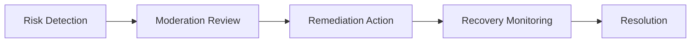

# Identity Remediation Framework

## Purpose

Defines remediation procedures for trust degradation, moderation escalation, suspicious behavior, and provider integrity recovery.

## Remediation Triggers

- repeated moderation violations
- suspicious engagement behavior
- tourism trust incidents
- fake review patterns
- recommendation manipulation attempts

## Remediation Actions

- visibility reduction
- temporary restriction
- moderation review
- trust-tier downgrade
- provider revalidation

## Remediation Lifecycle

## Recovery Principles

Remediation systems must:

- preserve marketplace trust
- preserve provider fairness
- preserve tourism quality
- preserve recommendation reliability

## MVP Boundary

Identity remediation remains operationally lightweight and moderation-driven.
