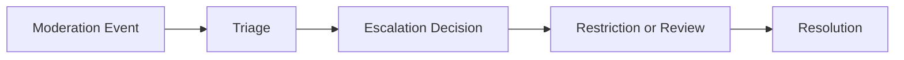

# Moderation Escalation Framework

## Purpose

Defines escalation procedures for moderation events impacting discovery integrity, tourism quality, provider quality, and marketplace trust.

## Escalation Triggers

- repeated spam
- fake engagement
- abusive reviews
- provider misconduct
- recommendation manipulation
- tourism deception

## Escalation Levels

### Level 1
Operational warning.

### Level 2
Visibility limitation.

### Level 3
Restricted participation.

### Level 4
Suspension and remediation review.

## Escalation Lifecycle

## Operational Principles

Moderation actions must:

- preserve marketplace trust
- preserve tourism quality
- avoid recommendation corruption
- avoid discovery manipulation

## MVP Boundary

Escalation remains human-review-aware and operationally lightweight.
