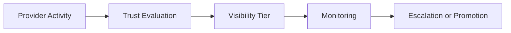

# Provider Trust Framework

## Purpose

Defines trust evaluation standards for providers participating in LUVO discovery, tourism, reservations, and commerce surfaces.

## Provider Trust Signals

- operational responsiveness
- listing completeness
- moderation history
- reservation reliability
- tourism quality
- review consistency
- discovery quality

## Trust States

- pending_review
- approved
- trusted
- flagship
- restricted
- suspended

## Trust Escalation

## Operational Rules

Providers with repeated moderation events may:

- lose sponsored visibility
- lose recommendation eligibility
- enter restricted visibility mode
- require manual review

## MVP Boundary

Trust scoring remains operational and moderation-aware. Advanced fraud ML and autonomous risk systems are out of scope.
