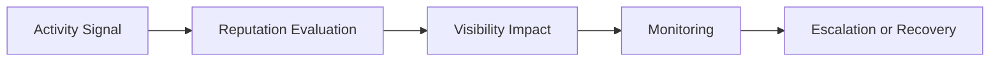

# Reputation Scoring Framework

## Purpose

Defines lightweight reputation evaluation standards for users and providers across discovery, tourism, reviews, reservations, and marketplace participation.

## Reputation Principles

Trust protects:

- discovery integrity
- tourism quality
- provider quality
- review integrity
- marketplace trust
- recommendation reliability

## Reputation Inputs

- review consistency
- moderation history
- reservation reliability
- provider responsiveness
- session consistency
- community engagement quality

## Reputation States

- neutral
- trusted
- high_trust
- restricted
- suspended

## Reputation Lifecycle

## MVP Boundary

The MVP uses operational scoring and moderation-aware heuristics. Advanced ML reputation systems remain out of scope.
