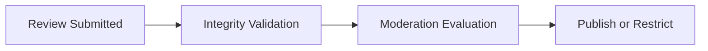

# Review Integrity Framework

## Purpose

Defines operational standards that preserve trustworthy reviews across discovery, tourism, commerce, and recommendations.

## Integrity Principles

Reviews must:

- reflect real experiences
- avoid manipulation
- preserve tourism quality
- preserve provider fairness
- preserve recommendation reliability

## Integrity Signals

- review consistency
- review timing anomalies
- moderation history
- account trust tier
- duplicate review patterns
- suspicious engagement spikes

## Moderation Actions

- review suppression
- visibility reduction
- moderation escalation
- provider trust impact
- recommendation confidence reduction

## Review Lifecycle

## MVP Boundary

The MVP prioritizes operational moderation workflows and trust-aware safeguards without advanced NLP fraud analysis.
