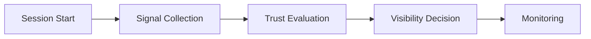

# Session Intelligence Framework

## Purpose

Defines lightweight session awareness standards for marketplace safety, moderation visibility, tourism trust, and recommendation reliability.

## Session Signals

- session continuity
- device consistency
- location consistency
- rapid behavioral anomalies
- repeated abuse attempts
- review burst patterns

## Operational Goals

- preserve marketplace trust
- reduce fake engagement
- reduce spam activity
- protect provider quality
- protect recommendation reliability

## Session Lifecycle

## Moderation Awareness

Suspicious session patterns may:

- reduce visibility
- trigger moderation review
- limit review publishing
- restrict recommendation influence

## MVP Boundary

No advanced behavioral AI, device fingerprint mesh, or adaptive ML risk infrastructure is included in MVP.
