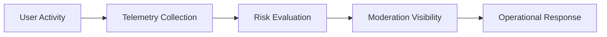

# User Safety Observability Framework

## Purpose

Defines operational telemetry and visibility standards for trust, moderation, provider safety, tourism quality, and recommendation integrity.

## Core Metrics

- moderation escalation rate
- fake engagement detection rate
- provider trust distribution
- review suppression rate
- recommendation integrity incidents
- tourism safety incidents
- suspicious session frequency

## Observability Goals

- preserve marketplace trust
- preserve discovery quality
- preserve tourism reliability
- improve moderation visibility
- improve operational response time

## Safety Telemetry Flow

## Operational Dashboards

- moderation queue visibility
- provider trust monitoring
- review integrity monitoring
- behavioral risk visibility
- tourism trust monitoring

## MVP Boundary

The framework remains operationally lightweight and dashboard-oriented without enterprise SIEM infrastructure.
