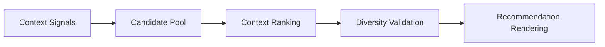

# Contextual Recommendation Engine

## Purpose

Defines contextual recommendation orchestration using lightweight operational signals.

## Context Signals

- time of day
- location proximity
- tourism mode
- session depth
- weather context
- vibe alignment
- exploration history

## Recommendation Priorities

- preserve recommendation diversity
- surface tourism-relevant places
- preserve local authenticity
- avoid repetitive recommendation chains

## Recommendation Flow

## MVP Boundary

The engine uses operational heuristics and metadata-driven ranking without ML inference infrastructure.
