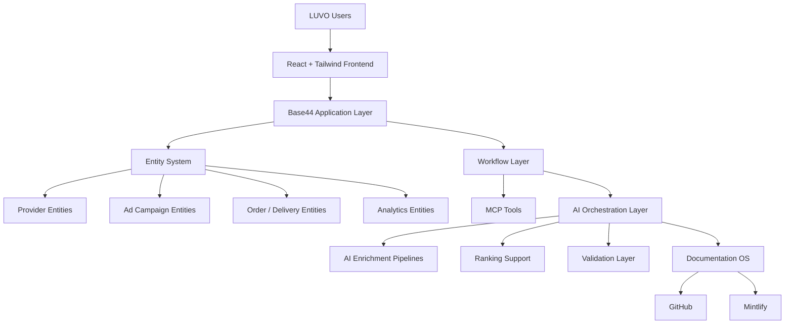
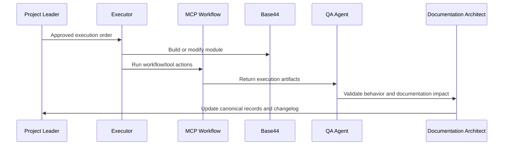

# LUVO Architecture Overview

## Architecture Objective

LUVO architecture is designed to support a modular AI-native platform using Base44, React, Tailwind, MCP workflows, entity-driven product development and multi-agent documentation/operations.

The architecture prioritizes speed of execution without sacrificing enterprise governance.

## Platform Stack

| Layer | Technology / System | Responsibility |
| --- | --- | --- |
| Application Builder | Base44 | Rapid application generation, entities, dashboards and workflows |
| Frontend | React | Component-driven user interfaces |
| Styling | Tailwind | Scalable utility-first visual system |
| Documentation | Mintlify | Developer/product/AI/operations documentation |
| Version Control | GitHub | Source control, pull requests, reviews and CI |
| AI Orchestration | Multi-agent workflows | Planning, execution, QA, enrichment and documentation |
| MCP Layer | MCP workflows | Tool connectivity, browser control, data operations and agent handoffs |
| Data Layer | Base44 Entities | Provider, campaign, user, order, opportunity and analytics entities |
| Analytics | Internal KPI system | Product, revenue, attribution and operational performance |

## High-Level System Architecture

## Modular Architecture

LUVO modules must remain independently documentable and operationally separable. A product module may depend on other systems, but its responsibility must remain explicit.

| Module | Boundary | Must Not Own |
| --- | --- | --- |
| Marketplace Engine | Discovery, profiles, reviews, menus, reservations entry points | Delivery dispatch logic |
| Ads Engine | Sponsored visibility, targeting, attribution, campaign metrics | Organic ranking ownership |
| Delivery System | Ordering, fulfillment, rider coordination | Tourism content curation |
| Tourism Engine | City exploration, local recommendations, visitor journeys | Provider onboarding workflows |
| Provider System | Provider onboarding, operational status, sales pipeline | Ad auction logic |
| AI Operating System | Agents, prompts, workflow orchestration, validation | Business policy ownership |

## Entity System

Base44 entities are the operational backbone of LUVO. Entities must be documented in Technical Sheets before production use.

Expected entity categories:

- Provider
- ProviderOpportunity
- UserAdProfile
- AdCampaign
- AdImpression
- AdInteraction
- RestaurantProfile
- TourismPlace
- DeliveryOrder
- RiderProfile
- AnalyticsEvent
- EditorialContent
- GeoArea

## Entity Governance

Every production entity requires:

- entity purpose
- owner
- fields
- validation rules
- lifecycle status
- dependencies
- privacy classification
- analytics usage
- AI enrichment eligibility

## MCP Workflow Layer

MCP workflows are used to coordinate non-manual operations, browser-assisted execution, testing, scraping, data enrichment, documentation updates and QA.

## AI Orchestration Layer

AI systems are not auxiliary. They form an execution layer across planning, enrichment, quality control, documentation and product operations.

Core AI functions:

- provider classification
- content enrichment
- tourism recommendation support
- ad ranking assistance
- prompt chain execution
- QA test generation
- documentation updates
- sprint summarization
- data normalization
- workflow routing

## Analytics Architecture

Analytics must measure both product and business outcomes.

Core analytics categories:

- user discovery behavior
- provider conversion
- reservation intent
- ordering funnel
- ad impressions
- ad interactions
- attribution
- delivery performance
- tourism engagement
- provider revenue potential
- AI enrichment quality

## Geographic Architecture

Geographic intelligence is central to LUVO.

The GEO Authority Engine must support:

- city-level discovery
- neighborhood relevance
- tourist zones
- provider proximity
- sponsored placement geography
- local category density
- experience clustering
- route and itinerary context

## Documentation Architecture

Mintlify and GitHub form the official documentation infrastructure.

Every production system must have:

- Product Sheet
- Technical Sheet
- Workflow Sheet if operationally automated
- Prompt references if AI-dependent
- ADR references if architectural
- Changelog
- KPI documentation

## Architecture Control Principle

LUVO architecture must support rapid Base44 execution while preserving modular documentation discipline. Speed is acceptable only when decisions remain traceable.
