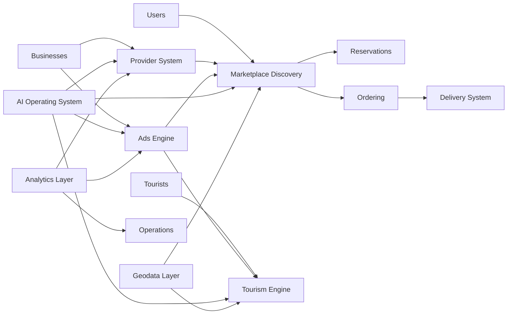

# LUVO Ecosystem Overview

## Executive Definition

LUVO is a local-first AI-native platform designed to convert city-level intent into measurable local commerce, reservations, tourism engagement, provider visibility and operational intelligence.

The platform is structured as a modular ecosystem, not a single-purpose delivery app. It connects locals, tourists, restaurants, experience providers, advertisers, riders, operators and AI agents through a unified marketplace and operating layer.

## Strategic Positioning

LUVO is positioned as:

- a local discovery marketplace
- a tourism and city guide platform
- a delivery and ordering ecosystem
- a reservation and experience layer
- an ads and monetization engine
- an AI-enriched geographic content system
- a provider operating system
- a hybrid human + AI execution platform

Its brand promise is:

> Descubre, pide y reserva.

Its explanatory phrase is:

> Todo lo local, en una app.

Its tourism expression is:

> Vive cada ciudad como local.

## Ecosystem Model

## User Groups

### Locals

Local users use LUVO to discover nearby restaurants, places, experiences, deals, events and services. Their value comes from convenience, relevance, trust, reviews, reservations and ordering.

### Tourists

Tourists use LUVO as a city companion. The platform helps them discover what to eat, where to go, what to reserve, what to experience and how to navigate the city like a local.

### Businesses

Businesses use LUVO to increase visibility, receive orders, capture reservations, publish content, participate in sponsored placements, measure performance and convert traffic into revenue.

### Providers

Providers include restaurants, tour operators, local attractions, service providers, venues, mobility partners, delivery partners and commercial advertisers.

### Operators

Operators manage onboarding, content QA, commercial pipelines, provider success, moderation, fulfillment, escalation and local market health.

### AI Agents

AI agents enrich provider content, classify businesses, optimize rankings, validate prompt outputs, support documentation, summarize sprints, assist QA and coordinate execution workflows.

## Core Modules

| Module | Purpose | Primary Value |
| --- | --- | --- |
| Marketplace Discovery Engine | Discover local providers, menus, places, reviews and offers | Demand aggregation |
| Tourism Engine | Curated city exploration, recommendations and itinerary support | Tourist conversion |
| Ads Engine | Sponsored visibility, geo-targeted promotion and future programmatic inventory | High-margin revenue |
| Delivery System | Ordering, dispatch and fulfillment coordination | Transactional monetization |
| Provider System | Business onboarding, profiles, pipeline and operations | Supply-side scalability |
| AI Enrichment Engine | Content classification, rewriting, tagging and ranking support | Scalable data quality |
| GEO Authority Engine | Geographic relevance, neighborhood logic and location authority | Local search quality |
| Analytics Layer | Revenue, attribution, provider performance and user behavior | Operational intelligence |

## Modular Vision

LUVO must scale to 100+ modules without losing coherence. The ecosystem therefore follows these rules:

1. Each module owns a defined business capability.
2. Each module has one canonical Product Sheet.
3. Each module has one canonical Technical Sheet.
4. Cross-module dependencies are declared explicitly.
5. AI workflows are documented separately from business logic.
6. ADRs govern structural changes.
7. Prompts are versioned and referenced by workflows.

## Operating Relationships

### Marketplace + Tourism

Marketplace organizes local providers. Tourism contextualizes them for visitors. The same provider can appear differently depending on intent: local dining, tourist discovery, sponsored placement or itinerary recommendation.

### Marketplace + Delivery

Marketplace creates demand. Delivery fulfills transactional intent. Ordering must remain decoupled from discovery so LUVO can support restaurants with or without delivery.

### Marketplace + Ads

Ads create monetization on top of discovery, but must not corrupt user trust. Sponsored ranking must be transparent, measurable and governed by relevance constraints.

### Provider System + AI

The Provider System captures raw business data. AI Enrichment transforms that data into structured, searchable, rankable and user-facing content.

### Analytics + Governance

Analytics measures whether modules create value. Governance ensures the documentation, prompts, workflows and ADRs remain coherent as the platform scales.

## Enterprise Documentation Rule

This document is the canonical ecosystem reference. Any document that describes LUVO at platform level must reference this page instead of redefining the ecosystem.
