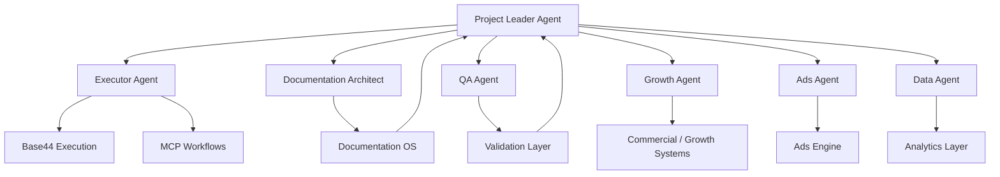
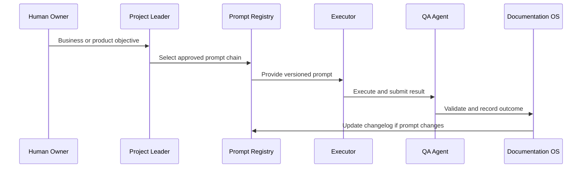

# LUVO AI Operating System

## Purpose

The LUVO AI Operating System coordinates human operators, AI agents, prompts, workflows, validation layers and MCP-enabled execution. It is designed to scale LUVO without losing context, quality or governance.

AI is not treated as a support tool. In LUVO, AI is an operating layer.

## Operating Philosophy

LUVO uses AI to amplify execution, not to replace accountability. Every AI workflow must have a human owner, a validation layer and a documented fallback path.

## Agent Architecture

## Core Agents

| Agent | Responsibility | Output |
| --- | --- | --- |
| Project Leader | Defines priorities, execution scope, sequencing and acceptance criteria | Execution order, sprint scope, decisions |
| Executor | Converts approved instructions into Base44 actions, prompts and implementation steps | Built features, logs, task completion |
| Documentation Architect | Maintains canonical docs, ADRs, changelogs, prompt registry and workflow registry | Documentation updates |
| QA Agent | Tests functionality, validates regressions, checks acceptance criteria and reports issues | QA reports, bug findings |
| Growth Agent | Structures acquisition, provider activation, monetization and commercial campaigns | Growth plans, sales playbooks |
| Ads Agent | Operates ad products, campaign logic, targeting, metrics and sponsored placements | Ads specifications and optimization |
| Data Agent | Defines metrics, event tracking, analytics structures and KPI consistency | Data dictionaries, KPI sheets |

## Prompt Chain Model

Prompts must be versioned, owned and attached to workflows.

## Prompt Governance

Every production prompt must define:

- objective
- owner
- version
- target model
- inputs
- outputs
- constraints
- guardrails
- failure modes
- cost sensitivity
- related workflows
- validation method

## Validation Layers

AI outputs are validated through layered controls.

| Layer | Purpose |
| --- | --- |
| Schema Validation | Confirms output matches required structure |
| Business Validation | Confirms output supports LUVO commercial logic |
| Safety Validation | Confirms output avoids prohibited or risky content |
| Brand Validation | Confirms voice, terminology and LUVO identity |
| Human Review | Confirms high-impact decisions before deployment |
| Documentation Review | Ensures canonical sources remain current |

## Memory Systems

LUVO memory must be explicit, scoped and documented.

Memory categories:

- brand memory
- product memory
- architecture memory
- sprint memory
- prompt memory
- workflow memory
- provider data memory
- commercial assumptions memory

No AI agent should rely on undocumented assumptions for production decisions.

## MCP Integrations

MCP workflows may support:

- Base44 execution
- browser testing
- GitHub operations
- documentation updates
- data extraction
- provider research
- QA workflows
- analytics review
- automated reporting

Every MCP dependency must be recorded in the relevant workflow document.

## Retry Logic

AI workflows must distinguish:

1. input failure
2. tool failure
3. model output failure
4. validation failure
5. business logic failure
6. documentation mismatch

Retries must not repeat the same failed prompt blindly. Each retry requires a modified constraint or corrected input.

## AI Workflow Lifecycle

| Status | Meaning |
| --- | --- |
| draft | Under design, not approved |
| review | Awaiting validation |
| approved | Ready for controlled execution |
| production | Used in operational workflows |
| deprecated | Replaced by better workflow |
| archived | Preserved for historical reference |

## Operating Risk

The primary risk in AI-native execution is not hallucination alone. It is undocumented automation.

A workflow is not acceptable unless its owner, inputs, outputs, dependencies, validation and rollback path are documented.
