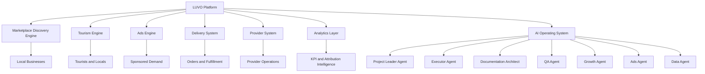

# LUVO Documentation Operating System

<Note>
The LUVO Documentation Operating System is the canonical coordination layer for product, engineering, AI workflows, operations, governance and institutional knowledge.
</Note>

## LUVO Documentation Operating System

LUVO is an AI-native, local-first platform built to connect people, travelers, local businesses, providers and operators through discovery, ordering, reservations, tourism experiences, ads, analytics and AI-enriched geographic content.

This documentation system is not a wiki. It is the operating layer that coordinates human teams, AI agents, product decisions, technical architecture, execution workflows and governance.

<CardGroup cols={2}>
  <Card title="Start with the Ecosystem" icon="map" href="/00-foundation/ecosystem-overview">
    Understand LUVO as a modular platform: marketplace, tourism, delivery, ads, providers, data and AI.
  </Card>
  <Card title="Read the Architecture" icon="diagram-project" href="/00-foundation/architecture-overview">
    Review the system structure across Base44, React, Tailwind, MCP workflows, entities and AI orchestration.
  </Card>
  <Card title="AI Operating System" icon="robot" href="/05-ai/ai-operating-system">
    Understand agents, prompts, validation layers, workflows, memory and MCP dependencies.
  </Card>
  <Card title="Product Engines" icon="grid-2" href="/12-marketplace/marketplace-engine.product-sheet">
    Review canonical product sheets for Marketplace and Ads Engine.
  </Card>
</CardGroup>

## Platform Overview

LUVO operates as a modular local commerce and experience platform.

| System | Role | Canonical Owner | Status |
| --- | --- | --- | --- |
| Marketplace Discovery Engine | Local discovery, profiles, reviews, menus, ordering and reservation journeys | Product | Production |
| Tourism Engine | Tourist-facing guide, itinerary context, city discovery and local experiences | Product / Growth | Production |
| Ads Engine | Sponsored placements, provider ads, targeting, attribution and future RTB layer | Growth / Ads | Production |
| Delivery System | Ordering, dispatch logic, rider coordination and provider fulfillment | Operations | Production |
| AI Systems | Enrichment, classification, ranking, prompt chains and agent coordination | AI Systems | Production |
| Provider System | Provider onboarding, opportunity tracking, commercial workflows and business profiles | Operations / Product | Production |
| Analytics | KPIs, attribution, provider performance, system health and revenue intelligence | Data | Production |

## Core Systems Grid

<CardGroup cols={3}>
  <Card title="Marketplace" icon="store" href="/12-marketplace/marketplace-engine.product-sheet">
    Discovery, reviews, reservations, ordering and local conversion.
  </Card>
  <Card title="Tourism" icon="location-dot" href="/11-tourism/README">
    City guide, insider recommendations, local routes and visitor journeys.
  </Card>
  <Card title="Ads" icon="bullhorn" href="/09-ads/ads-engine.product-sheet">
    Sponsored placements, targeting, attribution and future programmatic revenue.
  </Card>
  <Card title="Delivery" icon="motorcycle" href="/10-delivery/README">
    Orders, dispatch, rider coordination, fulfillment and provider operations.
  </Card>
  <Card title="AI Systems" icon="wand-magic-sparkles" href="/05-ai/ai-operating-system">
    Multi-agent workflows, prompt registries, enrichment and validation.
  </Card>
  <Card title="Provider System" icon="users-gear" href="/13-provider-system/README">
    Provider onboarding, commercial pipeline, opportunities and operational status.
  </Card>
</CardGroup>

## Documentation Principles

| Principle | Operating Rule |
| --- | --- |
| Single Source of Truth | Each decision, system and product module has one canonical document. |
| Canonical Ownership | Every document has an accountable owner and reviewers. |
| AI-native Documentation | Docs are structured for humans and machine consumption. |
| Immutable ADRs | Architecture decisions are recorded permanently and never overwritten. |
| Human + AI Coordination | Workflows define agent responsibilities, handoffs and validation layers. |
| Versioned Knowledge | Every document follows semantic versioning and lifecycle status. |

## System Status

| Category | Systems | Operating Interpretation |
| --- | --- | --- |
| Production Systems | Marketplace, Ads, AI Enrichment, Provider System, Tourism, Delivery, Analytics | Systems considered core to LUVO execution and documentation governance. |
| Experimental Systems | RTB Ads, Programmatic Inventory, Advanced Travel Engine, Automated Editorial Intelligence | Systems that require ADRs before full production adoption. |
| Deprecated Systems | Mintlify starter pages, demo examples, generic placeholder docs | Removed from canonical navigation and must not be referenced. |

## Architecture Map

## Operating Standard

Every production module must maintain:

- Product Sheet
- Technical Sheet
- ADR linkage
- Prompt Registry linkage when AI-dependent
- Workflow Registry linkage
- Changelog
- KPI definition
- Owner and reviewers
- Dependency map

<Warning>
No module is considered enterprise-ready without ownership, versioning, dependencies and canonical source designation.
</Warning>
